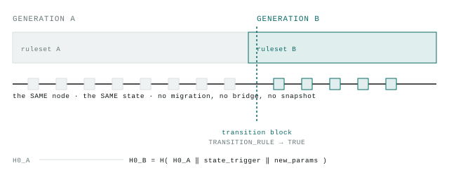

# Geminis · generational-switching demo (Colosseum Crypto World's Fair)

*[Leer esto en español](README.md)*

This repo is the submission for the **Colosseum Crypto World's Fair** hackathon
(9/14–10/12/2026). It's a slice of **Geminis** (deterministic-succession design,
[`github.com/cristiandkzk/deterministic-succession`](https://github.com/cristiandkzk/deterministic-succession)),
a protocol that lets a chain change its own *ruleset* — including the
cryptographic primitive that signs it — without a human fork, verifiable by
anyone. The full design, the bilingual paper, and how to contribute your own
measurements live in that repo; this repo holds only the minimal mechanism,
running.

**Live demo (nothing to clone):** [geminis-succession-ihy4.vercel.app](https://geminis-succession-ihy4.vercel.app/)
— a real run visualized, and a panel to break the lineage and watch
`Verify()` flip from `True` to `False`.

```
python verificar.py       # the 81 tests in this slice
python verificar.py -v    # with each criterion's name
```

No dependencies: Python 3.11+ standard library only.

<picture>
  <source media="(prefers-color-scheme: dark)" srcset="docs/figura-conmutacion-dark.en.svg">
  
</picture>

*The node's track doesn't stop at the transition block: it switches rules.
State crosses over intact because it never leaves the process that holds it.*

## What this actually is

The paper's core mechanism (§2): a node reaches a *trigger*, computes
`H0_B = H(H0_A ‖ state_trigger ‖ new_params)`, switches its own ruleset
**in-place** — without moving state — and anyone can run
`Verify(H0_B, H0_A, ...)` and confirm the succession is legitimate.

This slice is **Phase 0 and Phase 1** of Geminis's reference implementation
(`genesis/` in the full repo), ported as-is:

| module | what it implements |
|---|---|
| `protocolo/genesis.py` | block 0: the descendant space, per-class `Δ`, `θ*`, `L_max`, the step ceiling |
| `protocolo/generacion.py` | ruleset, generation tag, fail-closed decoding (I5) |
| `protocolo/linaje.py` | `H0_B = H(H0_A ‖ state_trigger ‖ params)` and its `Verify` (I4) |
| `protocolo/invariantes.py` | I1–I5 as executable predicates |
| `sucesion/regla.py` | `TRANSITION_RULE` — includes `ReglaCanarioCriptografico`: the trigger is a broken ML-DSA-44 canary, which activates a new successor primitive (§6.6) |
| `sucesion/cronograma.py` | trigger → lock-in → activation, with more than one transition in flight |
| `sucesion/conmutador.py` | the switch itself |
| `estado/sintetico.py` | minimal state: balances + generation tag |
| `nodo/pod.py` | applies blocks, evaluates the rule, switches, reorganizes |
| `pruebas/` | the 81 criteria, with the criterion's text in the docstring |

**The canary case is already included**: `ReglaCanarioCriptografico` uses a
real ML-DSA level (44) as the canary — not an invented value. The successor
format is a configurable parameter of the rule; this run uses the same name
by default, like the rest of the slice's parameters (disposable by
declaration). The canary is derived from a public seed (`g.CANARIO_SEMILLA`)
and the node verifies it on every block: an instance that doesn't come from
that seed doesn't pass (`pruebas/test_i2_quien_elige_el_momento.py`).

## The machine that executes the switch (`predicado/vm/`, Rust)

Geminis's Phase 4, ported in full. **It does not use wasmi or any WASM VM**
— that was the original plan, revised once the actual implementation was
inspected — it's a from-scratch RV32IM interpreter, **with no dependencies**
(not even `std` beyond the minimum), reusing the harness from
`test2-interprete/telefono` (the same ML-DSA-44 `guest.elf`, referenced byte
for byte, not copied). It runs third-party programs under budget — the real
case of a challenge/dispute, not a trusted benchmark:

```
cd predicado/vm
cargo test --release                          # 20 criteria (C1-C7)
cargo run --release --bin vectores verificar   # C3: 7 vectors, bit for bit
cargo run --release --bin bloque               # C1: 67 verifications as a block
```

Two consensus ceilings, not one: steps **and** distinct memory pages touched
(`lw` costs 23× more without the page cached, same opcode as `addi` — Phase
4's finding). Out-of-range is a deterministic trap, not `address & MASK`
(that depends on memory size and breaks I1 across generations). Every final
verdict is encoded in 5 bytes with no text, so it can enter the block hash.

**Verified in this repo** (9/14): it compiles and the 20 tests plus the 7 C3
vectors reproduce exactly as in the original implementation — self-contained,
no dependencies to fetch.

## Watch the mechanism run (`herramientas/demo.py`)

One run, one process, no network: two transition classes firing
**overlapped** (the circulation one gives 64 blocks' notice, the
cryptographic one gives 8 — which is why `Δ` is per-class, not global), the
ML-DSA-44 canary getting spent while the other transition is still in
flight, both switching in the same block, and at the end the lineage chain
verified explicitly:

```
python herramientas/demo.py
```

The last section prints `Verify(checkpoints, H0_GENESIS) = True` over that
run's chained generations — the paper's `Verify(H0_B, H0_A, ...)`, not an
assertion hidden inside a test. Above that, the line
`recibo-1 nació en la generación 0` ("recibo-1 was born in generation 0")
stays readable after two switches: the old object is still valid (I5) and
state never moved (I3) — it's the same `id(nodo.estado)` start to finish.

**To see that same run at a glance** (not an illustration: it's the real
data that run produced):
[geminis-succession-ihy4.vercel.app/timeline.html](https://geminis-succession-ihy4.vercel.app/timeline.html)
— or open [`docs/timeline.html`](docs/timeline.html) locally, a static
file, no server, no dependencies. Regenerate it with
`python docs/capturar_datos.py`.

**And to see what happens if someone tampers with the chain**, without
taking anyone's word for it:
[geminis-succession-ihy4.vercel.app/verify.html](https://geminis-succession-ihy4.vercel.app/verify.html)
— nine real ways to break `Verify()`, computed by running
`docs/capturar_verify_demo.py` (the same scenarios as
`pruebas/test_linaje.py`), not simulated in the browser.

## What's declared in the submission

**Pre-existing** (outside the 9/14–10/12 hackathon window, declared as
such): the full Geminis paper, the evidence against Ethereum
(EIP-7892/8261/8368), the interpreter-budget benchmark from
`test2-interprete` (3.2–3.7× native with JIT, not the 26–54× of a pure
interpreter the paper had assumed) — **and the succession engine and the
machine themselves** (Phase 0-1 and Phase 4 of the reference implementation,
built and committed to the `Geminis` repo on 8/22/2026, commit `8cbeeb2`,
three and a half weeks before the window opened). The mechanism running here
was designed and tested before the hackathon; this doesn't hide that.

**New, within the 9/14–10/12 window:** this repo. The self-contained slice
(`geminis-succession`), ported and verified on 9/14; the explicit
`Verify(checkpoints, H0_GENESIS)` added to `herramientas/demo.py` (the
original didn't print it); the bilingual docs; and the fix to the phone
packaging instructions, which had gone stale during the port. This is what
turns private research into something anyone can clone and run end to end —
each of these changes is datable by commit in this repo, not the original
one.

## What's deliberately missing from this slice

- **The replay harness against Ethereum** (difficulty bomb, blobs, gas
  limit) and **settlement/ordering** (Geminis Phases 2 and 3) — external
  evidence and a settlement mechanism, not needed for this mechanism.
- The video itself — the script above is ready to record, nothing's been
  recorded yet.

Everything here is disposable by design, same as in the full repo: the
parameters are toy values, they exist so the mechanism can run.
