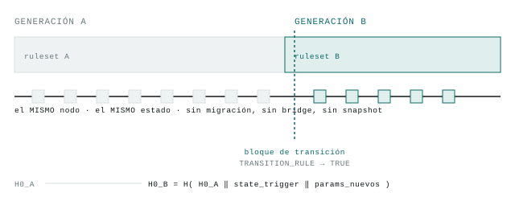

# Geminis · demo de conmutación generacional (Colosseum Crypto World's Fair)

*[Read this in English](README.en.md)*

Este repo es el submission del hackathon **Colosseum Crypto World's Fair**
(14/9–12/10/2026). Es un recorte de **Geminis** (antes *Genesis*,
[`github.com/cristiandkzk/Geminis`](https://github.com/cristiandkzk/Geminis)),
un protocolo que hace que una cadena cambie su propio *ruleset* —incluida la
primitiva criptográfica que la firma— sin fork humano, verificable por
cualquiera. El diseño completo está en el paper del repo Geminis; acá vive
sólo el mecanismo mínimo, corriendo.

**Demo en vivo (sin clonar nada):** [geminis-succession-ihy4.vercel.app](https://geminis-succession-ihy4.vercel.app/)
— una corrida real visualizada, y un panel para romper el linaje y ver
`Verify()` pasar de `True` a `False`.

```
python verificar.py       # las 81 pruebas de este recorte
python verificar.py -v    # con el nombre de cada criterio
```

Sin dependencias: sólo la biblioteca estándar de Python 3.11+.

<picture>
  <source media="(prefers-color-scheme: dark)" srcset="docs/figura-conmutacion-dark.svg">
  
</picture>

*La pista del nodo no se corta en el bloque de transición: cambia de reglas.
El estado cruza intacto porque nunca sale del proceso que lo tiene.*

## Qué es esto exactamente

El mecanismo central del paper (§2): un nodo llega a un *trigger*, computa
`H0_B = H(H0_A ‖ state_trigger ‖ params_nuevos)`, conmuta su propio ruleset
**in-place** —sin mover el estado— y cualquiera puede correr
`Verify(H0_B, H0_A, ...)` y confirmar que la sucesión es legítima.

Este recorte es **Fase 0 y Fase 1** de la implementación de referencia de
Geminis (`genesis/` en el repo completo), portadas tal cual:

| módulo | qué implementa |
|---|---|
| `protocolo/genesis.py` | el bloque 0: el espacio de descendientes, `Δ` por clase, `θ*`, `L_max`, el techo de pasos |
| `protocolo/generacion.py` | ruleset, etiqueta de generación, decodificación que falla cerrado (I5) |
| `protocolo/linaje.py` | `H0_B = H(H0_A ‖ state_trigger ‖ params)` y su `Verify` (I4) |
| `protocolo/invariantes.py` | I1–I5 ejecutables |
| `sucesion/regla.py` | `TRANSITION_RULE` — incluye `ReglaCanarioCriptografico`: el trigger es un canario ML-DSA-44 roto, que dispara la sucesora ML-DSA-87 (§6.6) |
| `sucesion/cronograma.py` | disparo → lock-in → activación, con más de una transición en vuelo |
| `sucesion/conmutador.py` | la conmutación en sí |
| `estado/sintetico.py` | el estado mínimo: balances + tag de generación |
| `nodo/pod.py` | aplica bloques, evalúa la regla, conmuta, reorganiza |
| `pruebas/` | los 81 criterios, con el texto del criterio en el docstring |

**El caso del canario ya viene incluido**: `ReglaCanarioCriptografico` usa
niveles reales de ML-DSA (44 como primitiva débil, 87 como sucesora) — no un
juguete inventado. El canario se deriva de una semilla pública
(`g.CANARIO_SEMILLA`) y el nodo lo verifica en cada bloque: una instancia que
no sale de esa semilla no pasa (`pruebas/test_i2_quien_elige_el_momento.py`).

## La máquina que ejecuta el switch (`predicado/vm/`, Rust)

Fase 4 de Geminis, portada completa. **No usa wasmi ni ninguna VM de WASM**
—eso era el plan original, revisado al mirar la implementación real—: es un
intérprete RV32IM propio, **sin dependencias** (ni siquiera de `std` fuera de
lo mínimo), que reutiliza el arnés de `test2-interprete/telefono` (el mismo
`guest.elf` de ML-DSA-44, referenciado por bytes exactos, no copiado). Corre
programas de terceros bajo presupuesto — el caso real de una impugnación, no
un benchmark de confianza:

```
cd predicado/vm
cargo test --release                          # 20 criterios (C1-C7)
cargo run --release --bin vectores verificar   # C3: 7 vectores bit-a-bit
cargo run --release --bin bloque               # C1: 67 verificaciones como bloque
```

Dos techos de consenso, no uno: pasos **y** páginas de memoria distintas
tocadas (`lw` cuesta 23× más sin la página en caché, mismo opcode que `addi`
— el hallazgo de la Fase 4). Fuera de rango es trampa determinista, no
`dirección & MASK` (eso depende del tamaño de memoria y rompe I1 entre
generaciones). Todo veredicto final se codifica en 5 bytes sin texto, para
que entre al hash del bloque.

**Verificado en este repo** (14/9): compila y los 20 tests + los 7 vectores
de C3 reproducen igual que en la implementación original — self-contained,
sin bajar dependencias.

## Ver el mecanismo corriendo (`herramientas/demo.py`)

Una sola corrida, un solo proceso, sin red: dos clases de transición
disparando **superpuestas** (la de circulación avisa 64 bloques antes, la
criptográfica 8 — por eso `Δ` es por clase y no global), el canario ML-DSA-44
gastándose mientras la otra transición sigue en vuelo, las dos conmutando en
el mismo bloque, y al final la cadena de linaje verificada explícitamente:

```
python herramientas/demo.py
```

La última sección imprime `Verify(checkpoints, H0_GENESIS) = True` sobre las
generaciones encadenadas de esa corrida — el `Verify(H0_B, H0_A, ...)` del
paper, no una aserción escondida en un test. Arriba de eso, la línea
`recibo-1 nació en la generación 0` sigue siendo legible después de dos
conmutaciones: el objeto viejo sigue válido (I5) y el estado nunca se movió
(I3) — es el mismo `id(nodo.estado)` de punta a punta.

**Para ver esa misma corrida de un vistazo** (no una ilustración: son los
datos reales que produjo la corrida de arriba):
[geminis-succession-ihy4.vercel.app/timeline.html](https://geminis-succession-ihy4.vercel.app/timeline.html)
— o abrí [`docs/timeline.html`](docs/timeline.html) local, es un archivo
estático, sin servidor ni dependencias. Se regenera con
`python docs/capturar_datos.py`.

**Y para ver que pasa si alguien manipula la cadena**, sin confiar en la
palabra de nadie:
[geminis-succession-ihy4.vercel.app/verify.html](https://geminis-succession-ihy4.vercel.app/verify.html)
— nueve formas reales de romper `Verify()`, calculadas corriendo
`docs/capturar_verify_demo.py` (los mismos escenarios que
`pruebas/test_linaje.py`), no simuladas en el navegador.

## Qué se declara en el submission

**Preexistente** (fuera de la ventana del hackathon 14/9–12/10, declarado como
tal): el paper completo de Geminis, la evidencia contra Ethereum
(EIP-7892/8261/8368), el benchmark de presupuesto del intérprete de
`test2-interprete` (3,2–3,7× nativo con JIT, no los 26–54× de intérprete puro
que el paper asumía) — **y el motor de sucesión y la máquina en sí** (Fase 0-1
y Fase 4 de la implementación de referencia, construidas y commiteadas en el
repo `Geminis` el 22/8/2026, commit `8cbeeb2`, tres semanas y media antes de
que abriera la ventana). El mecanismo que corre acá se diseñó y se probó
antes del hackathon; esto no lo esconde.

**Nuevo, dentro de la ventana 14/9–12/10:** este repo. El recorte
self-contained (`geminis-succession`), portado y verificado el 14/9; el
`Verify(checkpoints, H0_GENESIS)` explícito agregado a `herramientas/demo.py`
(el original no lo imprimía); la documentación bilingüe; y la corrección de
las instrucciones de empaquetado para teléfono, que habían quedado
desactualizadas al portar. Es lo que convierte investigación privada en algo
que cualquiera puede clonar y correr de punta a punta — cada uno de estos
cambios está fechado por commit en este repo, no en el original.

## Qué falta a propósito (no está en este recorte)

- **Harness de replay contra Ethereum** (bomba de dificultad, blobs, gas
  limit) y **liquidación/orden** (Fases 2 y 3 de Geminis) — evidencia externa
  y mecanismo de settlement, no hace falta para este mecanismo.
- El video en sí — el guion de arriba está listo para grabar, no se grabó
  nada todavía.

Todo lo de acá es desechable por declaración, igual que en el repo completo:
los parámetros son de juguete, existen para que el mecanismo corra.
